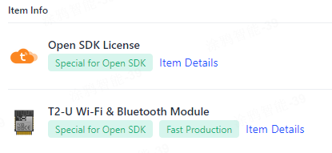

## Tuya Cloud Applications Project

The Tuya Cloud Application is an application provided by the Tuya IoT platform, which allows developers to quickly implement features such as remote control and device management.

`switch_demo` demonstrates a simple, cross-platform, cross-system switch example that supports multiple connections. Through the Tuya APP and Tuya Cloud Service, this switch can be remotely controlled.

1. Create a product and obtain the product PID:

Refer to the documentation [https://developer.tuya.com/cn/docs/iot-device-dev/application-creation?id=Kbxw7ket3aujc](https://developer.tuya.com/cn/docs/iot-device-dev/application-creation?id=Kbxw7ket3aujc) to create a product on [https://iot.tuya.com](https://iot.tuya.com) and obtain the PID of the created product. Replace the `TUYA_PRODUCT_KEY` macro in the [apps/tuya_cloud/switch_demo/src/tuya_config.h](./src/tuya_config.h) file with the PID.

2. Confirm the Tuya Cloud authorization code:
tuyaopen uses a dedicated authorization code for tuyaopen. Using other authorization codes will not allow normal connection to the Tuya Cloud.

```shell
[switch_demo.c:220] Replace the TUYA_DEVICE_UUID and TUYA_DEVICE_AUTHKEY contents, otherwise the demo cannot work
[switch_demo.c:222] uuid uuidxxxxxxxxxxxxxxxx, authkey keyxxxxxxxxxxxxxxxxxxxxxxxxxxxxx
```

The dedicated authorization code for tuyaopen can be obtained through the following methods:

- Method 1: Purchase a module with a tuyaopen authorization code pre-burned. The authorization code is already burned in the corresponding module at the factory and will not be lost. tuyaopen reads the authorization code through the tuya_iot_license_read() interface at startup. Please confirm whether the current device has a tuyaopen authorization code pre-burned.

- Method 2: If the current module is not pre-burned with a tuyaopen authorization code, you can purchase an Open SDK Authorization Code through the https://platform.tuya.com/purchase/index?type=6 page and put 'TUYA_DEVICE_UUID' and 'TUYA_DEVICE_AUTHKEY' in the [apps/tuya_cloud/switch_demo/src/tuya_config.h](./src/tuya_config.h) file Replace the uuid and authkey obtained after successful purchase



```c
    tuya_iot_license_t license;

    if (OPRT_OK != tuya_iot_license_read(&license)) {
        license.uuid = TUYA_DEVICE_UUID;
        license.authkey = TUYA_DEVICE_AUTHKEY;
        PR_WARN("Replace the TUYA_DEVICE_UUID and TUYA_DEVICE_AUTHKEY contents, otherwise the demo cannot work");
    }
```

> If the `tuya_iot_license_read()` interface returns OPRT_OK, it indicates that the current device has a tuyaopen authorization code pre-burned. Otherwise, it indicates that the current module is not pre-burned with a tuyaopen authorization code.