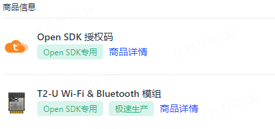

## 涂鸦云应用
涂鸦云应用是涂鸦 IoT 平台提供的一种应用，通过涂鸦云应用，开发者可以快速实现设备远程控制、设备管理等功能。

`switch_demo` 演示一个简单的，跨平台、跨系统、支持多种连接的开关示例，通过涂鸦 APP、涂鸦云服务，可以对这个开关进行远程控制。

1. 创建产品并获取产品的 PID：

参考文档 [https://developer.tuya.com/cn/docs/iot-device-dev/application-creation?id=Kbxw7ket3aujc](https://developer.tuya.com/cn/docs/iot-device-dev/application-creation?id=Kbxw7ket3aujc) 在 [https://iot.tuya.com](https://iot.tuya.com) 下创建产品，并获取到创建产品的 PID 。

然后替换 [apps/tuya_cloud/switch_demo/src/tuya_config.h](./src/tuya_config.h) 文件中 `TUYA_PRODUCT_KEY` 宏分别对应 pid。

2. 确认涂鸦云授权码：
tuyaopen 采用 tuyaopen 专用授权码，使用其他授权码无法正常连接涂鸦云。

```shell
[switch_demo.c:220] Replace the TUYA_DEVICE_UUID and TUYA_DEVICE_AUTHKEY contents, otherwise the demo cannot work
[switch_demo.c:222] uuid uuidxxxxxxxxxxxxxxxx, authkey keyxxxxxxxxxxxxxxxxxxxxxxxxxxxxx
```

可通过以下方式获取 tuyaopen 专用授权码：

- 方式1：购买已烧录 tuyaopen 授权码模块。该授权码已经在出厂时烧录在对应模组中，且不会丢失。tuyaopen 在启动时通过 `tuya_iot_license_read()` 接口读取授权码。请确认当前设备是否为烧录了 tuyaopen 授权码。

- 方式2：如当前模组未烧录 tuyaopen 授权码，可通过 [https://platform.tuya.com/purchase/index?type=6](https://platform.tuya.com/purchase/index?type=6) 页面购买 **Open SDK 授权码**，然后将 [apps/tuya_cloud/switch_demo/src/tuya_config.h](./src/tuya_config.h) 文件中 `TUYA_DEVICE_UUID` 和 `TUYA_DEVICE_AUTHKEY` 替换为购买成功后获取到的 `uuid` 和 `authkey`。



```c
    tuya_iot_license_t license;

    if (OPRT_OK != tuya_iot_license_read(&license)) {
        license.uuid = TUYA_DEVICE_UUID;
        license.authkey = TUYA_DEVICE_AUTHKEY;
        PR_WARN("Replace the TUYA_DEVICE_UUID and TUYA_DEVICE_AUTHKEY contents, otherwise the demo cannot work");
    }
```

> 如 `tuya_iot_license_read()` 接口返回 OPRT_OK，则表示当前设备已经烧录了 tuyaopen 授权码，否则表示当前模组并未烧录 tuyaopen 授权码。